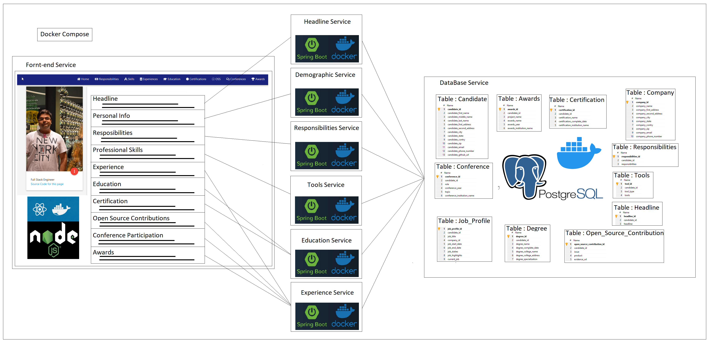
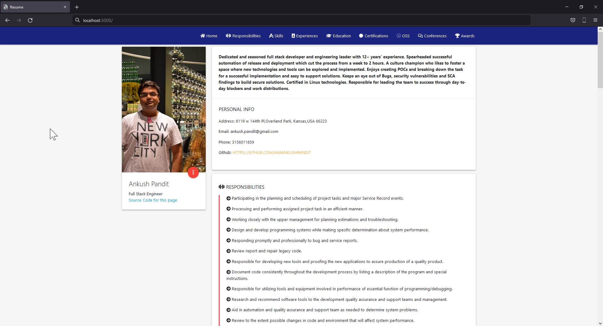
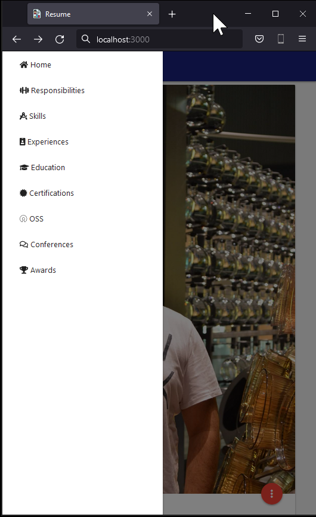

# Full Stack Resume

This project is a POC project to show how a full-stack application can be developed.  To demonstrate this, I wanted to make a web application that utilizes microservices.

## Stack

|Component|Description|
|----------|-------------|
|Services|Micro services are built using SpringBoot, Java 8, Maven, and Reactor.|
|Front End|The UI is based on React and Node JS.|
|Database|PostgreSQL|
|Containerization|Docker, Docker Compose|


## Idea
The idea is to build a resume application where the collection of different attributes of a candidate can demonstrate the use of the stack mentioned above. Utilizing the micro frontend and micro service architecture it will be a good idea to divide all these attribute section in to a vertical slice i.e. Each section of the resume should be supported by different set of micro services so that if one fails the whole resume UI should be effected.

Also, even though the rest services did not need to be fully CRUD in this resume web application, they were designed to be fully CRUD so that if the application is ever advanced to be used for other applicantopns. There can be other UI components that can be created for entering and updating details.

## Architecture


The application is divided in to 3 layers. These 3 layers can be divided into 8 services:
#### A. Front-end :
  1. resume-frontend: This service is built using react js and node js and dockerized.
#### B. Data Base :
  1. postgres: This service is a PostgreSQL DB with tables listed in the image above and dockerized.
#### C. Rest services:
  1. demographicservice: This service is a CRUD spring boot service that manages demographic information for a candidate.
  2. educationservice: This service is a CRUD spring boot service that manages education information like degrees and certification for a candidate.
  3. experienceservice: This service is a CRUD springboot service that manages experience information like Job profiles, Awards, Conference, and open source contributions for a candidate
  4. headlineservice: This service is a CRUD spring boot service that manages one paragraph detailing information about a candidate.
  5. responsibilitiesservice: This service is a CRUD spring boot service that manages responsibilities information for a candidate.
  6. toolsservice : This service is a CRUD spring boot service that manages education information like skills in different tools for a candidate.

#### Docker Files
Docker files for the services are similar and contain the following:
```
FROM openjdk:8-jre-alpine
ARG JAR_FILE=target/*.jar
COPY ${JAR_FILE} app.jar
ENTRYPOINT ["java","-jar","/app.jar","-Xmx600M"]
```
This means to use the openjdk:8-jre-alpine image and add layers on top of it. With experimentations, it was determined that the safe value for -Xmx can be 600M for all services.

Docker file for the frontend contains the following:
```
# pull official base image
FROM node:13.12.0-alpine

# set working directory
WORKDIR /app

# add `/app/node_modules/.bin` to $PATH
ENV PATH /app/node_modules/.bin:$PATH

# install app dependencies
COPY package.json ./
COPY package-lock.json ./
RUN npm install --silent
RUN npm install react-scripts@3.4.1 -g --silent

# add app
COPY . ./

# start app
CMD ["npm", "start"]
```

#### Docker Compose
Docker-compose is used to tie all of the services together. The yml file describes
a. Container name
b. Any environmental variables.
c. Internal and external port
d. dependency within each other
e. volumes if applicable.

Initially, in the development process, this is all set up locally to test.  For the local environment, for each service, a docker image is created.
For the maven-based back-end services, the following command was used.
```
mvnw spring-boot:build-image -Dspring-boot.build-image.imageName=com.example.resume/<service-name>
```
For the frontend service, the following command was used.
```  
docker build -t com.example.resume/frontend:latest
```  
For the data base, the base and latest PostgreSQL image was used.

When the ``` docker-compose up ``` is executed on the directory containing the docker-compose yml file, Docker will download the latest image, which in this case was local, and then bring them up based on the dependency defined.

## Outcome
A local web application is created whose UI is hosted on http:\\localhost:3000 and the respective backend services on their ports specified in the application.properties file. The PostgreSQL database starts on 5432 port. The UI is designed to be open on the computer or a phone browser is specified.



Desktop View


Mobile Browser View


Mobile Navigation Bar

## Cloud
The next step is to put this web application which consists of these services to the cloud. There are many contenders for this space but only Heroku and AWS were considered.  The idea was to keep costs low to none.

### DockerHub
At this point, to make the images accessible for the cloud provider to run them as containers, they had to be published somewhere is a docker repository. For this DockerHub was chosen. The names of the images had to be changed as a result. They went from com.example.resume/<service-name> to ankushpandit/<service-name>. The reason for doing so is that for personal docker images the username had to be tagged along and the format is <username>/<service-name>. This change was then applied to the docker-compose file. Since the PostgreSQL is a standard image this change did not affect it.Since the

### Heroku
I have heard about Heroku as there is a way to host your spring boot services for free and hence, this was the first place where the back-end services were deployed. But we ran into an issue. Heroku does not have a clear and precise way to support a docker compose file. So the next thing to try was AWS.

### AWS
AWS is widely known as THE cloud service to host your content on to and provides a whole lot of services to help people do so. A basic EC2 instance with a t2.micro with 1 GB ram was created. Once the instance was up docker, docker-compose and git were installed on it. Once the project is cloned, the docker-compose command can be executed. This was going fine until the 1 GB RAM was insufficient for running 8 containers on it. At this point, to get the work visible to the public the idea for using docker-compose was abandoned. The learning had not stopped though. Overall docker-compose is a really fast and easy way to map and set up services with one command.

#### Work Around
Since docker compose is not an option with the available with the cost of resources being between low to none it made more sense to do what docker compose was doing but manually. For this, 8 EC2 instance were create, one to host each service listed above. The security policies were configured to open the correct port and CORS code in the services was updated. For each instance, docker was installed and the images were pulled manually from the DockerHub repo and started as containers.
 
#### Cost
 
The cost of the above setup is about $2.40 per day. Which is still higher than expected. This project as an experiment is good but to be able to make it more production ready resources and for them a good budget is required.

## Outcome

This web app is hosted at https://bit.ly/3LkzcX5 . If the site is down, I have run out of budget to keep it hosted 24/7. If you would like to take a look at the site please contact me at ankush.pandit@gmail.com and I will love to bring it live for you.

## CI-CD
The CI-CD is baed on Github actions. This option was chosen to keep the cost down. As this project is open source the github actions are free. This was desined in a way that each time we pust a change to the main branch, each service is then compiled, built, dockerize, taged and deployed as an image on DockerHub.

## Future Thoughts:
1. Breaking the UI in to micro front end architecture: Since the project is divided in 8 services, if one or more services are down the application will still keep functioning and provide the information about the candidate. But if the front end service went down becase of a code issue in one of the react or node compoment, then candidates application could not be accessed. The better way to design this will be to breat the frontend in to smaller compoments based on the react components. This will enable to have one vertical slice for each section. This will make the application more robust and will enable the developer to work in parallel while adding new features.
2. Telemetry : There is no way to judge the performance and understand the load for the services that are running. Telemetry can help us get that insight.
3. Breaking in to smaller repo : For this experiment, it was ideal that all code remains at the same place hence a mono repo made sense. If this is a production level code and product making smaller feature based repos can help the CI-CD be faster as it would only need to compiled, built, dockerize, taged and deployed the feature that is being worked on.
4. Splunk : Currently we do not have access to the logs unless we log in to the particular EC2 instance.  Having the logs forwared to a centerally deployed splunk instance will make it really easy to support the application.
5. Security : Right now here are places in the code where some values are hard coded. This was not the intention but because of the time constrains I have left the code as is. The point of the project is to demonstrate the capability of having such an app.
6. Support more then one candidate / Auth :  Having an auth page, will make is more secure and more candiates can be supported right now the candidate id is hard coded to 1.
7. Eureka Server : This is a service resistration and discovery service. This helps improve the security of the backend services but sheilding their ports on which they are running. A service registry is useful because it enables client-side load-balancing and decouples service providers from consumers without the need for DNS.
8. Automated Unit testing : Like mentioned earlier, the scope of the project was to understand how to build a full stack application and hence these were left. But these are very important of a production ready application for both front end and backend services.
9. Used to build a candidate database: Since the backend service are built with CRUD in mind we can add more UI components which will enable other candidates to add and update their profiles.
10. Smaller image size : Right now there was no considrations given about the size of the image. With the basic CRUD functionality backend services, it should not create a image that is about 400 MB.
11. Blue Green Deployment : Currently when we make the change, we have to log in to each instance and reload the image and start it as a container. While this is done the public facing application is down. The Blue Green deployment stratigy will help remidiate that.
